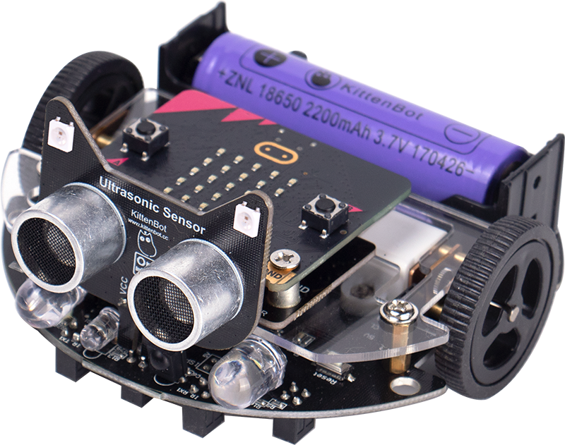

# MiniLFR



## Feature

* This extension is designed to programme and drive the miniLFR car for micro:bit, You can [get minilfr From KittenBot](https://item.taobao.com/item.htm?spm=a1z10.3-c-s.w4002-21482550023.41.72385d5fjjtkhP&id=553539619464)

1. This robot car with the mega 328 MCU is already assembled; it can be connected to the Micro:bit and programmed with MakeCode.

2. There is a 4-pin IO port in the front of the car. By plugging different electronic modules, you can add functions like ultrasonic obstacle avoidance, ws2812 LED control and LED matrix display.

3. The car is small and flat, which is suitable for all ages to start to learn programming as beginners.

4. The built-in rechargeable 18650 lithium battery allows you to charge the car with the USB cable.

5. There is a special firmware on the car that features functions like PID line following and obstacle avoidance, which is suitable for beginners to finish and showcase their project easily.


## Basic usage

* ws2812 LED ring

```blocks

    minilfr.minilfrInit()
    let num = 0
    basic.forever(function () {
        for (let index = 0; index < 15; index++) {
            num += 1
            minilfr.RingRgbStatic(num, minilfr.NeoPixelColors.Red)
            basic.pause(200)
        }
        basic.pause(500)
        minilfr.RingAllRgbStatic(minilfr.NeoPixelColors.Black)
        basic.pause(500)
        for (let index = 0; index < 15; index++) {
            minilfr.RingRgb(
            num,
            0,
            0,
            255
            )
            num += -1
            basic.pause(100)
        }
        basic.pause(500)
        minilfr.RingAll(0, 0, 0)
        basic.pause(500)
    })

```

---

* LED on minilfr

```blocks

    input.onButtonPressed(Button.A, function () {
        minilfr.spotLight(minilfr.ONOFF.ON, minilfr.ONOFF.ON)
        basic.pause(500)
        minilfr.spotLight(minilfr.ONOFF.OFF, minilfr.ONOFF.OFF)
    })
    input.onButtonPressed(Button.B, function () {
        minilfr.rgbBrightness(255)
        minilfr.hoverRgbStatic(minilfr.RGBIDX.ALL, minilfr.NeoPixelColors.Red)
        basic.pause(1000)
        minilfr.rgbBrightness(30)
        minilfr.hoverRgb(
        minilfr.RGBIDX.ALL,
        0,
        255,
        0
        )
        basic.pause(1000)
        minilfr.hoverRgbStatic(minilfr.RGBIDX.ALL, minilfr.NeoPixelColors.Black)
    })
    minilfr.minilfrInit()

```

---

* Buzzer

```blocks

    input.onButtonPressed(Button.A, function () {
        minilfr.buzz(200, 100)
        basic.pause(500)
        minilfr.buzz(300, 200)
        basic.pause(500)
        minilfr.buzz(400, 300)
        basic.pause(500)
        minilfr.buzzBuildMusic(minilfr.LFRMelodies.Ode)
    })
    input.onButtonPressed(Button.B, function () {
        minilfr.buzzMusic("c4:4 g3:2")
    })
    minilfr.minilfrInit()

```

---

* Ultrasonic sensor from KittenBot

```blocks

    minilfr.minilfrInit()
    basic.forever(function () {
        if (minilfr.Ultrasonic() < 15) {
            minilfr.UltrasonicRgbStatic(minilfr.RGBIDX.ALL, minilfr.NeoPixelColors.Red)
        } else {
            minilfr.UltrasonicRgbStatic(minilfr.RGBIDX.ALL, minilfr.NeoPixelColors.Green)
        }
    })

```

---

* Car move
```blocks

    input.onButtonPressed(Button.A, function () {
        minilfr.spotLight(minilfr.ONOFF.ON, minilfr.ONOFF.ON)
        minilfr.motorSpeed(255, 255)
        basic.pause(1000)
        minilfr.spotLight(minilfr.ONOFF.OFF, minilfr.ONOFF.OFF)
        minilfr.motorSpeed(-255, -255)
        basic.pause(1000)
    })
    input.onButtonPressed(Button.B, function () {
        minilfr.motorStop()
    })
    minilfr.minilfrInit()

```

---

* Line Follow
```blocks

input.onButtonPressed(Button.A, function () {
    minilfr.calibrateSensor()
})
input.onButtonPressed(Button.AB, function () {
    minilfr.goIdle()
})
input.onButtonPressed(Button.B, function () {
    minilfr.goLinefollow()
})
minilfr.minilfrInit()
basic.forever(function () {
    if (minilfr.SensorRead(minilfr.SensorEnum.B) < 50) {
        minilfr.spotLight(minilfr.ONOFF.OFF, minilfr.ONOFF.ON)
    } else if (minilfr.SensorRead(minilfr.SensorEnum.D) < 50) {
        minilfr.spotLight(minilfr.ONOFF.ON, minilfr.ONOFF.OFF)
    } else {
        minilfr.spotLight(minilfr.ONOFF.OFF, minilfr.ONOFF.OFF)
    }
})

```

## License

MIT

## Supported targets

* for PXT/microbit
* for PXT/arcade

```package
minilfr=github:Kittenbot/pxt-minilfr
```